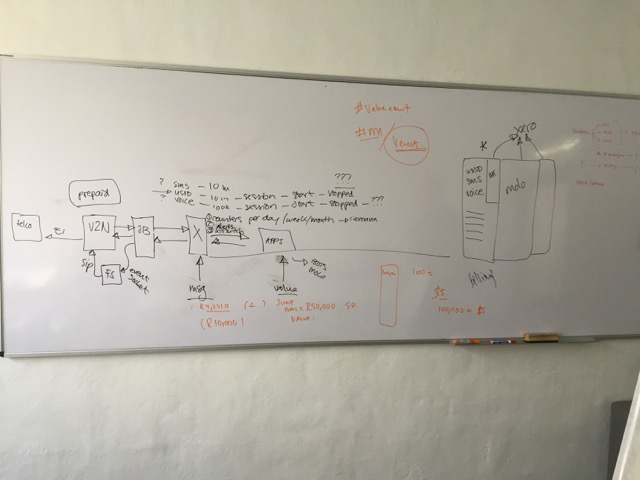
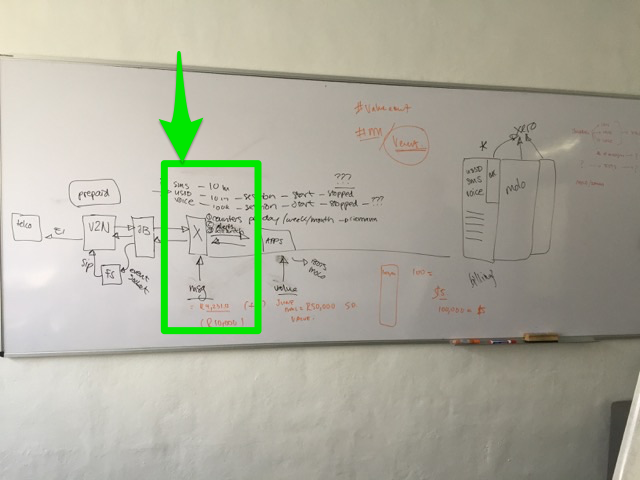

Workshop
********

A workshop was held between:

- Simon de Haan
- Nickolas Grigoriadis
- Gustav Praekelt
- Bruce McIntyre

on 7 June 2016.

From there the following diagram was whiteboarded:

We are focusing specifically on the highlighted area below for the Seed
accounting development.

Design
******

In the current Vumi Go implementation there is a billing module that handles
most of the credits and rating.

The reference code is here:
https://github.com/praekelt/vumi-go/tree/develop/go/billing

.. todo:: Speak to Rudi and Justin WRT billing.

Focus
*****

Seed is currently being deployed in a number of different countries.

These countries have a variety of billing requirements and modes of operation.

Because Seed Accounting needs to cater for all these, we separate the accounting
from the billing and rating functions of the system.

Approach
********

As Seed is being developed incrementally, it's important that the accounting
foundation be:

- extensible
- simple
- robust
- persisted

Coupled with these requirements, we also need a working implementation
specifically for HelloMama (MomConnect Nigeria) and FamilyConnect (MomConnect
Uganda).

.. todo:: What else is required?
